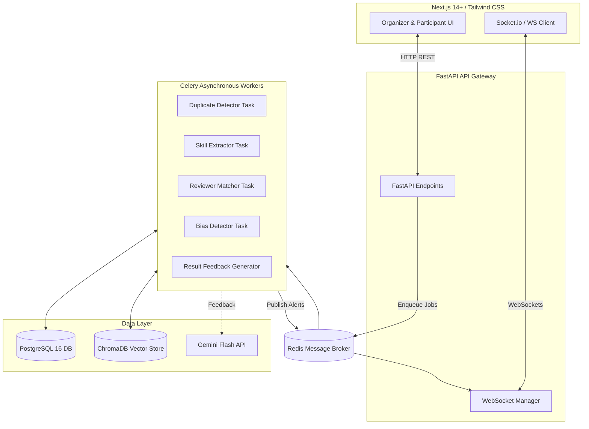

# AI-Enabled Hackathon Management Dashboard
### Dell Hackathon 2026 (Team: S, A, AT, RV, V)

Welcome to the **AI-Enabled Hackathon Management Dashboard** repository. This platform is a unified, production-grade solution designed to automate the entire lifecycle of running a hackathon—from participant registration, duplicate detection, and automated skill profiling to AI-assisted reviewer matching, real-time bias detection, and ranking/feedback generation.

---

## 🚀 Key Features

1. **AI Registration Intelligence**:
   - Asynchronous duplicate detection utilizing `sentence-transformers` (`all-MiniLM-L6-v2`) via semantic vector similarities in ChromaDB.
   - Skill extraction and profile tagging from free-form user bios using spaCy Natural Language Processing (`en_core_web_sm`).
2. **AI Reviewer Assignment**:
   - Optimal global reviewer-to-submission assignment using the Hungarian optimization algorithm via `scipy.optimize.linear_sum_assignment`.
   - Incorporates expertise similarity, current reviewer load balance, conflict of interest checks, and demographic diversity boosts.
3. **AI Bias Detection**:
   - Real-time z-score monitoring of incoming evaluation scores to detect gender, institutional, or geographic bias.
   - Live WebSocket alerts pushed instantly to the organizer dashboard.
4. **Automated Feedback & Results Generation**:
   - Rubric-weighted score aggregation and tie-breaking metrics.
   - Personalized constructively-critical feedback generation using the Google Gemini 1.5 Flash API (with offline template fallbacks).
5. **Analytics Dashboard**:
   - Interactive charting for registrations, track distributions, judging progress, and bias alerts breakdown.

---

## 🏗️ System Architecture



---

## 📂 Repository Structure

The project is structured as a clean, decoupled monorepo:

* **`/frontend`**: Next.js 14+ single-page application utilizing TypeScript, Tailwind CSS, shadcn/ui components, Zustand for state management, and Recharts.
* **`/backend`**: FastAPI application hosting the core REST API and WebSocket gateway.
* **`/ai`**: Dedicated ML/NLP models, vector clients, and Celery asynchronous tasks for executing computationally heavy tasks off the HTTP thread.
* **`/data`**: Seeding scripts and SQL definitions containing high-fidelity synthetic demo data.
* **`/tests`**: Comprehensive unit and integration test suite targeting the FastAPI endpoints, ML pipelines, and Celery tasks.

---

## 🛠️ Getting Started (Local Setup)

### Prerequisites
- Python 3.11+
- Node.js 18+
- PostgreSQL 16
- Redis 7

### Installation

1. **Clone and Configure**:
   ```bash
   cp .env.example .env
   # Fill out database URLs, secrets, and optional GEMINI_API_KEY
   ```

2. **Database Initialization**:
   Ensure PostgreSQL is running and create the database:
   ```sql
   CREATE DATABASE hackathon_db;
   ```

3. **Install Backend & Worker Dependencies**:
   ```bash
   pip install -r requirements.txt
   # Download the spaCy English model
   python -m spacy download en_core_web_sm
   ```

4. **Install Frontend Dependencies**:
   ```bash
   cd frontend
   npm install
   ```

5. **Start Services (via Setup Script or Manually)**:
   - **PostgreSQL / Redis**: Ensure their daemons are running.
   - **Celery Worker**: `celery -A backend.celery_app worker --loglevel=info`
   - **API Server**: `uvicorn backend.main:app --reload --port 8000`
   - **Frontend Dev Server**: `npm run dev` (running at `http://localhost:3000`)
